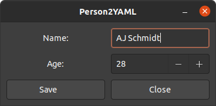

# person2yaml

`person2yaml` is a small, state-of-the-art GUI application that converts user input into a YAML file, `output.yaml`. It's built with [gtkmm](https://www.gtkmm.org/en/), which is the C++ binding for the [gtk](https://www.gtk.org/) interface library.

The purpose of this project was to gain some familiarity with C++ and Makefiles.
